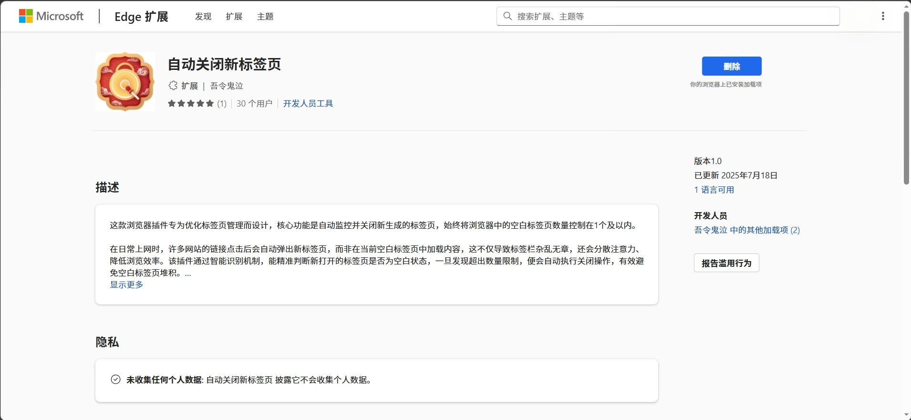

# 自动关闭新标签页 - Edge 浏览器插件

一款专为优化标签页管理而设计的 Edge 浏览器插件，能够自动监控并关闭新生成的空白标签页，提升浏览效率。

## ✨ 功能特点

- 🎯 **智能监控**：自动检测浏览器中的空白标签页数量（限制在 1 个及以内）
- 🖱️ **鼠标离开触发**：当鼠标离开空白新标签页超过 0.5 秒时，自动关闭该标签页
- 🔧 **一键开关**：提供简单的启用/禁用按钮，操作便捷
- ⚡ **高效管理**：有效避免浏览器被大量空白标签页占用资源

## 📦 安装方式

### 从 Edge 扩展商店安装（推荐）

1. 访问 [Microsoft Edge 扩展商店](https://microsoftedge.microsoft.com/addons)
2. 搜索 **"自动关闭新标签页"**
3. 点击 **"获取"** 或 **"安装"** 按钮
4. 完成安装后即可使用

### 手动安装（开发者版本）

本项目提供两个版本：

#### 中文版
- 路径：`自动关闭新标签的插件（中文）/`
- 适合中文用户使用

#### English Version
- 路径：`Auto-Close-New-Tab-Extension/`
- 适合英文用户使用

**手动安装步骤：**

1. 打开 Edge 浏览器，访问 `edge://extensions/`
2. 开启右上角的 **"开发人员模式"**
3. 点击 **"加载解压缩的扩展"**
4. 选择对应的插件文件夹
5. 插件将自动加载并出现在扩展列表中

## 🛠️ 技术细节

- **插件类型**：Manifest V3 浏览器扩展
- **主要权限**：
  - `tabs` - 管理标签页
  - `scripting` - 执行脚本
  - `storage` - 存储用户设置
- **核心功能**：后台服务持续监控标签页状态，自动关闭多余的空白标签页

## 📋 使用说明

1. 安装插件后，浏览器工具栏会出现插件图标
2. 点击图标可打开设置面板
3. 插件会自动在后台运行，无需额外配置即可生效
4. 当打开新标签页后，如果鼠标离开该空白标签页超过 0.5 秒，该标签页会被自动关闭

## 🔒 隐私说明

本插件：
- ❌ 不收集任何个人数据
- ❌ 不向第三方发送信息
- ✅ 所有数据本地处理
- ✅ 符合 Edge 扩展商店隐私政策要求

## 💡 适用场景

- 经常浏览会自动弹出新标签页的网站
- 希望保持浏览器整洁的用户
- 需要提高浏览效率的工作场景
- 厌烦手动关闭大量空白标签页的用户

## 📊 用户评价

⭐⭐⭐⭐⭐ (5/5 星)
- 已有 30+ 用户在使用
- 版本：1.0
- 最后更新：2025年7月18日

## 🤝 支持

如果您在使用过程中遇到问题或有功能建议，欢迎通过以下方式反馈：
- 在 Edge 扩展商店页面留言评价
- 查看"开发人员工具"了解技术详情

---

**提示**：推荐从 Edge 扩展商店官方渠道安装，可获得自动更新和更好的安全性保障。
